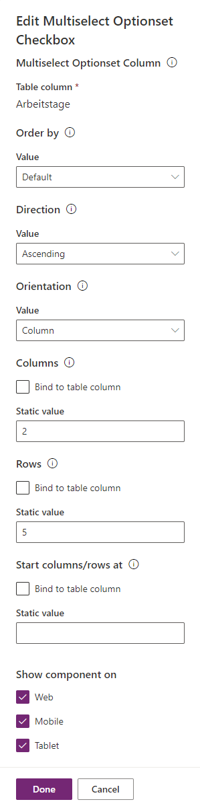

# Multi Optionset Checkbox

## Description
This control allows users to select multiple options from a multi optionset using checkboxes. It provides a customizable grid layout for displaying the options and supports ordering options by optionset value or alphabetical order. Additionally, it supports sorting in ascending or descending order and specifying the grid orientation (row or column).

## Installation
To use the control in your environment

- Download the latest `Solutions.zip` from the [Releases](https://github.com/)
- Import the solution
- Add the control to a Choices field with multiple choices allowed
- Configure the control properties

## Configuration
- OrderBy: Select the order of the optionset values (Default, OptionSetValue or Alphabetical).
- Direction: Sort the values in ascending or descending order.
- Orientation: Select the grid direction (row or column).
- Columns: Set the number of columns in the grid.
- Rows: Set the number of rows in the grid.
- Start columns/rows at: Set the starting characters split at which a new column/row should start.

## License
This project is distributed under the MIT License. See [LICENSE](LICENSE) for more information.